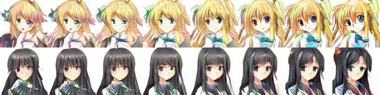

# Create Animated Character based on CGAN

## Introduction

The project is to train a generative network that can generate "real" animated character according to the given label. The core technique of the project is the conditional GAN.

The networks are trained on Google Cloud, and the project is implemented in Python and Tensorflow.

## Data

The dataset we used is the open-source dataset used in [twinGAN](https://github.com/jerryli27/TwinGAN). The dataset contains more than 20k images, and each image is labeled with 51 possible tags.

## Network

Generator

Discriminator

Note: "K5S2F128" means the convolution with kernal size as 5, stride as 2 and number of filters as 128.

## Loss Function

<a href="http://www.codecogs.com/eqnedit.php?latex=\large&space;\begin{aligned}&space;\mathcal{L}_{adv}(D)&=-2\cdot\mathbb{E}_{x\sim&space;P_{data}}\left[D(x)\right]&plus;1.5\cdot\mathbb{E}_{z\sim&space;P_{noise},c\sim&space;P_{cond}}\left[D(G(z,c))\right]&plus;0.5\cdot\mathbb{E}_{x\sim&space;P_{negative}}\left[D(x)\right]\\&space;\mathcal{L}_{gp}(D)&=\mathbb{E}_{x\sim&space;P_{perturbed\,data}}\left[(||&space;\nabla_{\hat{x}}D(\hat{x})||_2-1)^2\right]\\&space;\mathcal{L}(D)&=\mathcal{L}_{adv}(D)&plus;\lambda_{gp}\mathcal{L}_{gp}(D)\\&space;\mathcal{L}(G)&=\mathbb{E}_{z\sim&space;P_{noise},c\sim&space;P_{cond}}\left[D(G(z,c))\right]\\&space;\lambda_{gp}&=20&space;\end{aligned}" target="_blank"></a>

The negative samples are generated by giving wrong label to real pictures.

The perturbed samples are generated by doing random linear interpolation between generated samples and real samples.

## Feature

- WGAN
- Residual Block
- Pixel Shuffler
- Features from Multiple Stages
- Negative Samples

## Replicability

The experiment sets batch size as 20, initial learning rate as 0.0002 for both generator and discriminator, max epoch as 80000. Both generator and discriminator are trained by Adam optimizer with .

## Performance

Good Results

Bad Results

Interpolation between two samples

Label Accuracy

